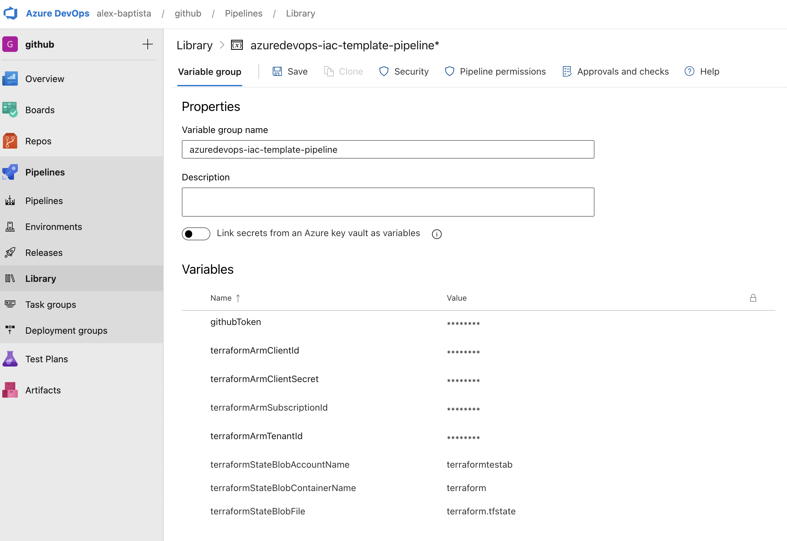
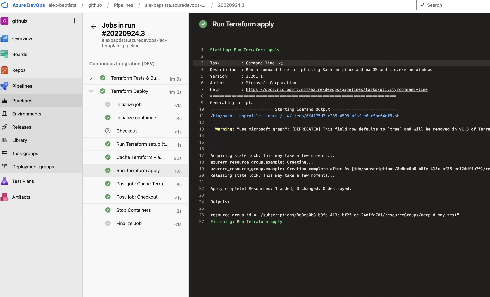
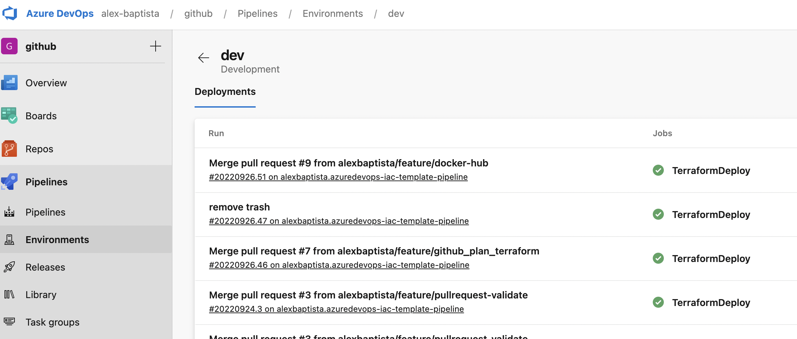
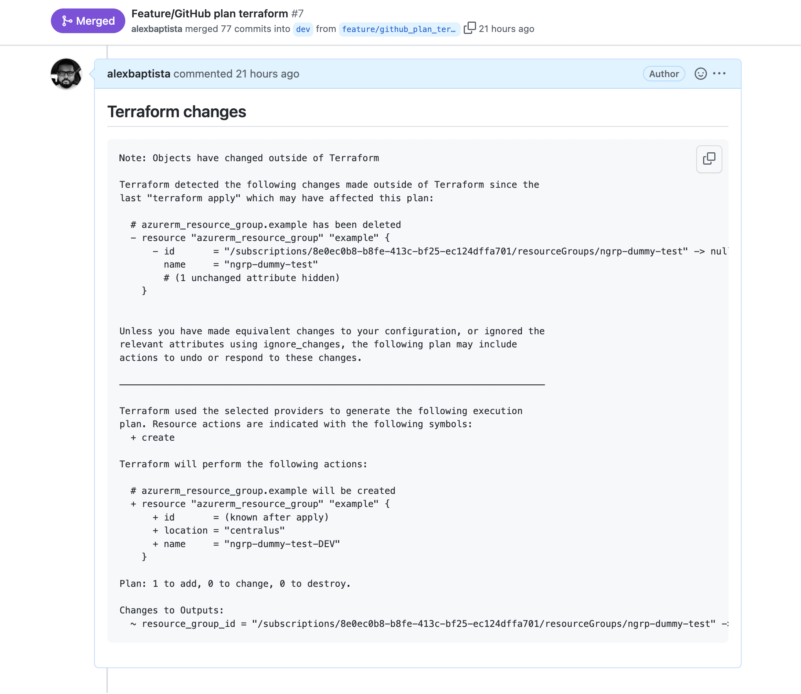

# azuredevops-iac-template-pipeline

Proof of Concept for Azure DevOps for Infrastructure as Code

My motivation here is, to explore some features from Azure DevOps, with minimal dependency from Marketplace Tasks, to understand how much Azure DevOps is customizable :);

This pipeline is to be used for `IaC (Infrastructure as code)`, adopting [Terraform](https://www.terraform.io/) and using **Microsoft Azure** as Cloud Provider;

## Structure

Initially, was designed to simulate deploy in 4 environments like:

* Development (**DEV**);
* Quality Assurance (**QA**);
* User Acceptante Tests (**UAT**);
* Production (**PRD**);

And contains these stages for each process like Continuous Integration and Continuous Delivery
environment.

**Continuous Integration/Delivery and Pull Request Steps**

| Tool | Action | Continuous Integration | Continuous Delivery | Pull Request |
| --- | --- | :-: | :-: | :-: |
| TFENV  | `Install` | :white_check_mark: | :white_check_mark: | :white_check_mark: |
| Terraform | `Format` | :white_check_mark: | | :white_check_mark: |
| Terraform | `Init` | :white_check_mark: | :white_check_mark: | :white_check_mark: |
| Terraform | `Workspace` | :white_check_mark: | :white_check_mark: | :white_check_mark: |
| Terraform | `Validate` | :white_check_mark: | :white_check_mark: | :white_check_mark: |
| TFLint | `Lint` | :white_check_mark: | | :white_check_mark: |
| TFSec | `SAST` | :white_check_mark: | | :white_check_mark: |
| Terraform | `Plan` | :white_check_mark: | :white_check_mark: | :white_check_mark: |
| Terraform | `Apply` | :white_check_mark: | :white_check_mark: | |
| Azure Tasks | `Cache` | :white_check_mark: | :white_check_mark: | |
| Pull Request Comment | `Github PR` | | | :white_check_mark: |
| Pull Request env | `export ENV` | | | :white_check_mark: |

:information_source: **note**

> This step has a specilized task `pullrequest-env.yaml` wich determine what will be the target environment to run `terraform plan` based on source and target branch:
> 
> eg. If there's a Pull Request opened with this caracteristics
> 
>   **source branch**: "refs/heads/dev"
>   **target branch**: "refs/heads/qa"
> 
> The Pull request will execute the terraform plan, using the workspace from target branch, in this case will be (QA).

### **Folder structure**

```
├── azure-pipelines.yaml
├── container-image
│   └── Dockerfile
├── example-iac
│   ├── README.md
│   ├── main.tf
│   ├── outputs.tf
│   └── variables.tf
├── pipeline
│   └── terraform.yaml
├── pipeline-jobs
│   ├── terraform-cd.yaml
│   ├── terraform-ci.yaml
│   └── terraform-pr.yaml
└── pipeline-tasks
    ├── github-pullrequest-comment.yaml
    ├── pullrequest-env.yaml
    ├── terraform-apply.yaml
    ├── terraform-cache.yaml
    ├── terraform-fmt.yaml
    ├── terraform-init.yaml
    ├── terraform-plan-to-json.yaml
    ├── terraform-plan.yaml
    ├── terraform-validate.yaml
    ├── terraform-workspace.yaml
    ├── tfenv-terraform-install.yaml
    ├── tflint-run.yaml
    └── tfsec-run.yaml
```

* **[container-image/*](container-image)**: Contains Dockerfile to build the base image that will be used for all steps from pipeline;
* **[example-iac/*](example-iac)**: In this folder, contains a Terraform code example (If you haven't any code to dry-run this pipeline as example);
* **[pipeline/*](pipeline)**: Has the file `terraform.yaml` that orchestrate all stages, importing templates per environment target;
* **[pipeline-jobs/*](pipeline-jobs)**: Has the specific files (eg, `terraform-cd.yaml` and `terraform-ci.yaml`) with logical sequence to execute CI, CD and Pull Request steps;
* **[pipeline-tasks/*](pipeline-tasks)**: Has the tasks to execute specialized jobs (eg, `terraform-init.yaml`), and some tasks are reused for compose jobs on `pipeline-jobs` layer;

## What provide

* **Terraform**
  * [Workspace](https://www.terraform.io/language/state/workspaces) Each Terraform configuration has an associated backend that defines how Terraform executes operations and where Terraform stores persistent data, like state;
  * [validate](https://www.terraform.io/cli/commands/validate) The command validates the configuration files in a directory;
  * [fmt](https://www.terraform.io/cli/commands/fmt) used to rewrite Terraform configuration files to a canonical format and style;
* **Add-ons**
  * [TFENV](https://github.com/tfutils/tfenv) - Its a easier Terraform version management;
  * [TFLINT](https://github.com/terraform-linters/tflint) - A Pluggable Terraform Linter;
  * [TFSEC](https://github.com/aquasecurity/tfsec) - tfsec uses static analysis of your terraform code to spot potential misconfigurations;

## Requirements

* **Azure (Cloud Computing)**
  * Active [Subscription](https://learn.microsoft.com/pt-br/azure/azure-portal/get-subscription-tenant-id)
  * Configure a [Service Principal with a Client Secret](https://registry.terraform.io/providers/hashicorp/azurerm/latest/docs/guides/service_principal_client_secret);
  
* **Azure DevOps**
  * Configure a [Variable Group Name](https://learn.microsoft.com/en-us/azure/devops/pipelines/scripts/cli/pipeline-variable-group-secret-nonsecret-variables?view=azure-devops)
  * Configure a [Blob Storage for Terraform Backend](https://learn.microsoft.com/en-us/azure/developer/terraform/store-state-in-azure-storage?tabs=azure-cli);
  * Configure [Environment Deploy](https://learn.microsoft.com/en-us/azure/devops/pipelines/process/environments?view=azure-devops) with these names **"DEV, QA, UAT and PRD"**;

* **Github**
  * Configure a [Github Token](https://docs.github.com/en/authentication/keeping-your-account-and-data-secure/creating-a-personal-access-token) with `repo:` permission (to allow write comments on Pull Requests );

* **Docker image**
  * It's necessary to build de Docker image [Dockerfile](container-image/Dockerfile) 

    (If you wish to keep and maintain the image private)

    But is possible to use the public image, available on link below:
    https://hub.docker.com/r/alxbap/azuredevops-iac-template-pipeline

## How to use

### **Azure Variable Group**

* Complete requirements above;
* During creation of the **Variable Group Name** is required the variables below to compose resource:

| Environment | Purpose |
| --- | :-: |
| `githubToken` | Github |
| `terraformArmClientId` | Azure credentials |
| `terraformArmClientSecret` | Azure credentials |
| `terraformArmSubscriptionId` | Azure credentials |
| `terraformArmTenantId` | Azure credentials |
| `terraformStateBlobAccountName` | Terraform Backend |
| `terraformStateBlobContainerName` | Terraform Backend |
| `terraformStateBlobFile` | Terraform Backend |

* **example**




### **Azure Pipeline Files**

File example can be accessed here [Azure Pipelines](example-azure-pipelines.yaml)

```YAML
name: $(Date:yyyyMMdd)$(Rev:.r)

pool:
  name: Default
  vmImage: hosted-azure

variables:
  - group: #### CONFIGURE_AZURE_DEVOPS_VARIABLE_GROUP ####

resources:
  repositories:
    - repository: Iac-template
      type: github
      endpoint: github.com_alexbaptista
      name: alexbaptista/azuredevops-iac-template-pipeline
      ref: refs/tags/v.1.3
  containers:
    - container: terraform
      image: docker.io/alxbap/azuredevops-iac-template-pipeline:v.1.3
      env:
        TF_STATE_BLOB_ACCOUNT_NAME:   #### CONFIGURE_STATE_BLOB_FOR_TERRAFORM_BACKEND ####
        TF_STATE_BLOB_CONTAINER_NAME: #### CONFIGURE_STATE_BLOB_FOR_TERRAFORM_BACKEND ####
        TF_STATE_BLOB_FILE:           #### CONFIGURE_STATE_BLOB_FOR_TERRAFORM_BACKEND ####
        ARM_SUBSCRIPTION_ID:          #### CONFIGURE_SERVICE_ACCOUNT_FOR_AZURE_CREDENTIALS ####
        ARM_CLIENT_ID:                #### CONFIGURE_SERVICE_ACCOUNT_FOR_AZURE_CREDENTIALS ####
        ARM_CLIENT_SECRET:            #### CONFIGURE_SERVICE_ACCOUNT_FOR_AZURE_CREDENTIALS ####
        ARM_TENANT_ID:                #### CONFIGURE_SERVICE_ACCOUNT_FOR_AZURE_CREDENTIALS ####
        TF_IN_AUTOMATION: 1
        TF_LOG: trace
        TF_LOG_PATH: terraform.log

trigger:
  branches:
    include:
      - #### CONFIGURE_BRANCHS_FOR_ALL_ENVIRONMENTS ####
  paths:
    exclude:
    - README.md

pr:
  branches:
    include:
      - #### CONFIGURE_BRANCHS_FOR_ALL_ENVIRONMENTS ####
  paths:
    exclude:
    - README.md

stages:
  - template: pipeline/terraform.yaml@Iac-template
    parameters:
      terraformPath: $(System.DefaultWorkingDirectory)/* #### CONFIGURE_DIRECTORY_TO_REACH_TERRAFORM_FILES ####
      terraformVersion: 1.2.7                            #### CONFIGURE_TERRAFORM_VERSION ####
      resourceContainer: terraform
      envConfig:
        DEV:
          environmentDeploy: dev          #### CONFIGURE_AZURE_DEVOPS_ENVIRONMENT_TO_DEPLOY ####
          gitBranch: refs/heads/(example) #### CONFIGURE_GIT_BRANCH_TO_REFER_ENVIRONMENT ####
        QA:
          environmentDeploy: qa           #### CONFIGURE_AZURE_DEVOPS_ENVIRONMENT_TO_DEPLOY ####
          gitBranch: refs/heads/(example) #### CONFIGURE_GIT_BRANCH_TO_REFER_ENVIRONMENT ####
        UAT:
          environmentDeploy: uat          #### CONFIGURE_AZURE_DEVOPS_ENVIRONMENT_TO_DEPLOY ####
          gitBranch: refs/heads/(example) #### CONFIGURE_GIT_BRANCH_TO_REFER_ENVIRONMENT ####
        PRD:
          environmentDeploy: prd          #### CONFIGURE_AZURE_DEVOPS_ENVIRONMENT_TO_DEPLOY ####
          gitBranch: refs/heads/(example) #### CONFIGURE_GIT_BRANCH_TO_REFER_ENVIRONMENT ####
        PR:
          githubToken: $(githubToken)     #### CONFIGURE_GITHUB_TOKEN ####
```

## Screenshots

### **Pipeline (Azure DevOps)**



### **Environment (Azure DevOps)**



### **Pull request (Github)**
  


## Motivations (And answers)

**Why I haven't adopted tasks ?**
  
> According this article (wrote by a Microsoft's Enginner, be adviced that is an Author vision, not represent the company's vision), there's an alternative way to management pipeline `without dependency from TASKS`, and keeping easier the lifecycle:
>
> https://julie.io/writing/terraform-on-azure-pipelines-best-practices#tip-4---authenticate-with-service-principal-credentials-stored-in-azure-key-vault

**Why I didn't applied "release" feature from Azure DevOps ?**

> This is a Great feature that provides a mechanism `to promote artifacts between stages`, but in this case, when we're handling with Terraform files (like terraform plan files) `isn't handleable` like a software package (like NodeJS, Java e etc), and is required to generate "the plan" for each environment, and the we got a high risk that this artifact to turn stale, because there's other conditions (like manual action in Cloud) that impact the Terraform Plan. And the Terraform is near to GitOps Philosophy and in my vision is better to use `Git as source of truth` and generate plan and apply in runtime execution and to use the environment feature from Azure DevOps with the "Approve stage" turn on.
  
**Why do not use Atlantis ?**
  
> Is a great resource, but is necessary to deploy and keep available, i consider adopt soon, but for now, i developed a `"rustic"` task only to report the Terraform Plan onto GitHub Pull Request.
  
**Why don't run build and installed dependencies inside host ?**
  
> I've been decided to use container inside `Host Agent`, because one from caracteristics from Azure DevOps, is isolated execution between stages, and i was determinated to go ahead with minimal dependency from Tasks (and some tools hasn't any Task ready from Marketplace), and i consider don't "dirty" the host with dependency, i strong believe that the host only should be used as a execution layer, the all dependencies i kept in container image, is more flexible to migrate and recover in disaster recovery.

## References

* https://www.terraform-best-practices.com/
* https://learn.microsoft.com/en-us/azure/devops/pipelines/yaml-schema/?view=azure-pipelines